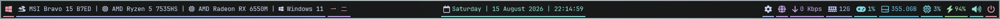

# YASB Catppuccin Mocha

A Clean + Minimal YASB Theme Inspired By The Catppuccin Mocha Color Palette Focusing On A Calm Dark Aesthetic With Subtle Accents + Simple Layouts + A Distraction-Free Desktop Experience

## Requirements

- Windows 11
- [YASB](https://github.com/amnweb/yasb)
- [JetBrainsMono Nerd Font](https://www.nerdfonts.com/font-downloads)
- [GlazeWM](https://github.com/glzr-io/glazewm)

## Installation

1. Install YASB + JetBrainsMono Nerd Font
2. Copy `config.yaml` + `styles.css` Into Your YASB Configuration Directory
3. Reload YASB
4. If You Use GlazeWM → Make Sure It Is Running For The Workspace Widgets To Work Correctly

## Features

- Catppuccin Mocha Color Palette
- Minimal Dark Bar Design
- Subtle Colored Widget Accents
- GlazeWM Workspace Integration
- CPU + GPU + Memory Monitoring
- Network Traffic Monitoring
- Wi-Fi Status
- Disk Usage
- Battery Status
- Volume Controls
- Control Center
- Calendar + Clock
- Power Menu
- Interactive System Information Popups
- JetBrains Mono Nerd Font Styling

## Info

- Theme: Catppuccin Mocha Minimalism
- Built For: YASB
- Color Palette: Catppuccin Mocha
- Font: JetBrainsMono Nerd Font
- Window Manager Integration: GlazeWM
